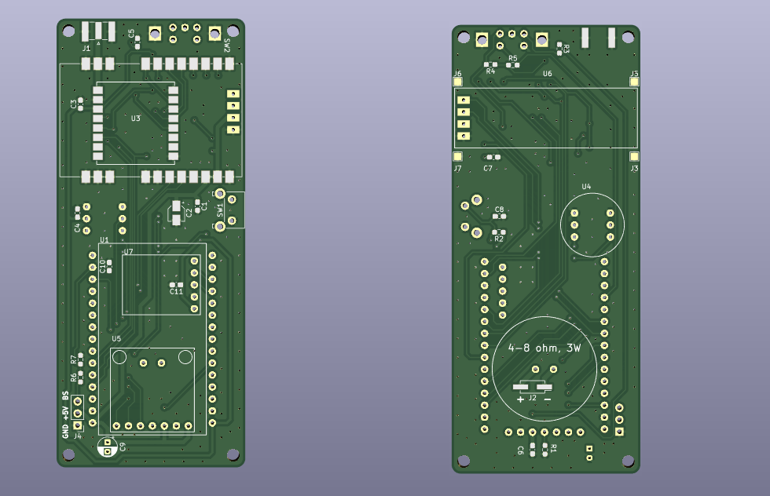

# ESP32 Codec2/OPUS DV Handheld Transceiver

## Introduction
This project is a hobby/amateur/toy/educational radio ESP32 based LoRa/FSK Codec2/OPUS DV 3d printed handheld trasceiver a.k.a. walkie-talkie, which is using 1W/2W E22-400M30S/E22-400M33S (SX1268) radio module (UHF, 70cm band) or optionally 100mW RA-01/RA-02 (SX1278) module. 

It mimics ordinary FM walkie-talkie, does not use any protocol for simplicity, just sends audio codec frames with pre-configured radio digital modulation.

Overall components cost for this project is about 15-20$.

Schematics for new board design with integrated components on the board is available under `extras/schematics`. Pinouts are compatible with first prototype version. There is place for GPS module, but do not solder it as there is no support for it, it just there for future experiments.

First prototype is based on https://github.com/sh123/esp32_loraprs modem, but uses additional peripherals:
- I2S speaker module MAX98357A + 4ohm 3w speaker (40mm diameter)
- I2S microphone INMP441
- PTT button
- Rotary encoder with push button
- Small OLED display SSD1306 128x32
- Battery voltage monitoring (just voltage divider fed into ADC pin, see schematics)
- Powered from a single commonly avaialble 18650 cell (for example from old laptop battery)
- Uses combined charge + 5v boost controller based on Hotchip HT4928S (it is usually used in low capacity single cell USB power banks).

Supports next features:
- Supports LoRa and FSK modulation with configurable modulation parameters from settings
- Supports Codec2 (low bit rate) and OPUS (medium/high bit rate) audio codecs, codec could be selected from settings
- Goes into ESP32 light sleep when no activity, so all power consumption is around 30-40mA when in sleep RX, wakes up on new data from radio module or when user starts transmitting, consumes about 90-100mA in active receive and about 700-800mA in full power 1W transmit
- Settings menu on long encoder button click, allows to change frequency and other parameters
- Output power tunable from settings from ~1mW (for ISM toy usage) up to 1W (for amateur radio experiments)
- Experimental no warranty privacy option for ISM low power usage (check your country regulations if it is allowed by the ISM band plan before experimenting as it might be illegal in some countries), it is based on [ChaCha20](https://en.wikipedia.org/wiki/Salsa20#ChaCha_variant) stream cypher provided by [rwheater/Crypto](https://github.com/rweather/arduinolibs) library, it is comparable to AES256, uses 256 bits key, but has lower CPU requirements and power usage.

## Build instructions
- Modify `include/config.h` if needed
- Install platformio
- Build with platformio
- Upload with platformio

## Pictures

Two fully 3d printed prototypes were built based on `esp32_loraprs` modem board.

List of peripherals used.

New board design with all components integrated into the board (except battery and charging circuit).

Case for the new board version with battery compartment.

Assembled board with new design.

